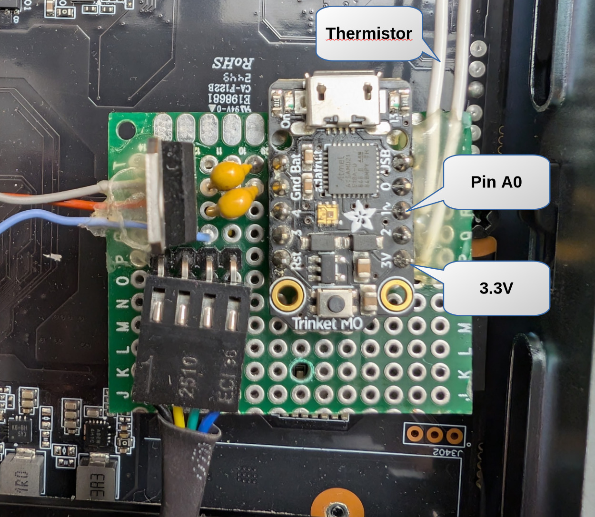
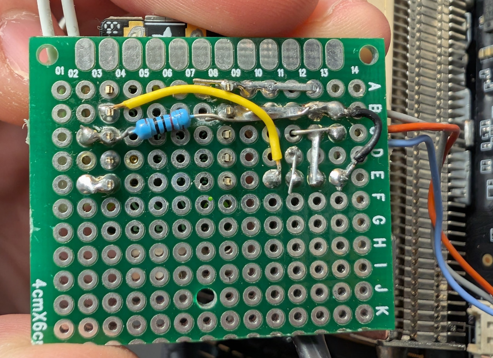
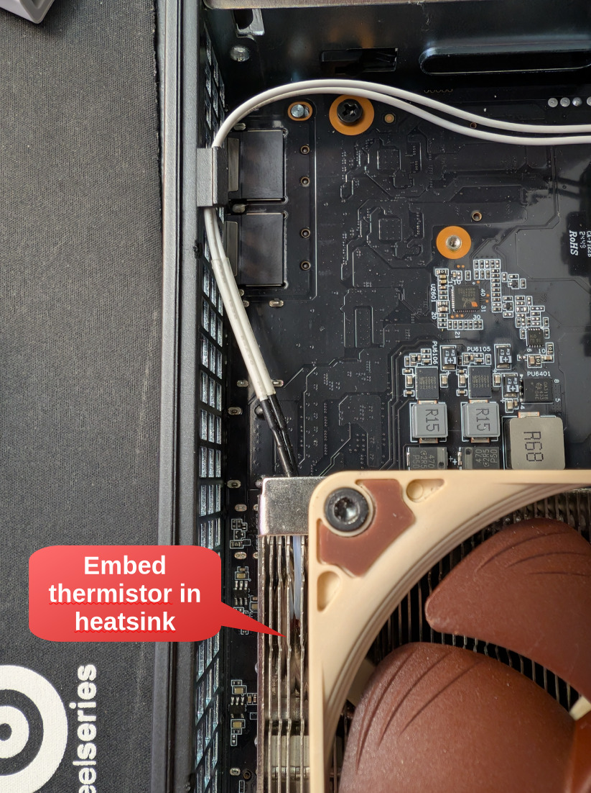

# MS-A1 Fan Controller

This is a fan controller for the Minisforum MS-A1, designed to run on an Adafruit Trinket M0 (or similar MCUs). It is intended for use with retrofitted third-party coolers to control a 4-wire PWM fan using a thermistor embedded in the cooler heatsink.

This was designed originally to support a Noctua NH-L9i cooler mod for this computer. ([Printables link](https://www.printables.com/model/1309017-minisforum-ms-a1-noctua-nh-l9i-am5-mount)). I also made a custom case for this mod ([Printables link](https://www.printables.com/model/1309100-minisforum-ms-a1-noctua-nh-l9i-case))

There's really nothing stopping you from using this on any computer where you want more control over the fan speed (rather than using the motherboard).

## Features / Notes

- Controls a PWM fan based on heatsink temperature
- Uses a thermistor for temperature sensing
- Smooths temperature readings with a rolling average filter
- Designed for use with 4-wire PWM fans (PWM, RPM, +12V, GND)
- Fan RPM is fed directly back to the motherboard via the RPM pin
- The motherboard's PWM pin is not connected

## Bill of Materials

- Adafruit Trinket M0 (or basically any other 5v microcontroller with at least 1 analog input and PWM capable digital output)
- LM7805 Voltage regulator
- 0.1uF capacitor (probably optional, for power decoupling)
- 0.33uF capacitor (probably optional, for power decoupling))
- 10K 3950 NTC Thermistor
- 10K resistor (or any resistor really, you can set the value in the code)
- 4 wire (PWM capable) fan

### Motherboard Fan Connector Pinout

This is a molex picoblade connector (I think)

| Color  | Function       | Notes                        |
|--------|----------------|------------------------------|
| Red    | +12V           | Power                        |
| Grey   | Ground         | Ground                       |
| Blue   | RPM Feedback   | Connects to fan RPM output   |
| Yellow | PWM            | Not connected                |

## Usage

1. Wire the circuit as shown in the schematic.
2. Update [`fan-controller.py`](fan-controller.py) with the values of your chosen thermistor, resistor and desired fan temperature set points.
3. Install the adafruit thermistor library module (`adafruit_thermistor.mpy`) into the `/lib` directory on the Trinket M0 from the [libaries bundle](https://circuitpython.org/libraries).
4. Copy the [`fan-controller.py`](fan-controller.py) script to your Trinket M0 and rename it `code.py`.
5. Power on the system. The fan speed will automatically adjust based on the heatsink temperature.

## Schematic

## Photos

### Motherboard fan connector pinout

### Board Top

### Board Bottom

### Thermistor Placement

